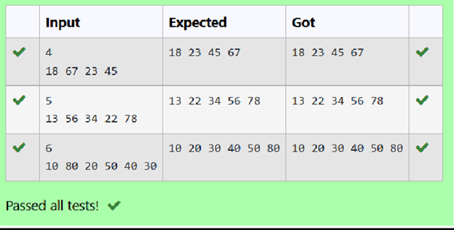

# Ex 3(B) Binary Search Tree
## DATE:25-04-225
## AIM:
To write a C function to insert the elements in the binary search tree

## Algorithm
1.Start
2.Check if the current node is NULL; if true, create a new node with the given key.
3.Allocate memory for the new node, set its key, and initialize its left and right children to NULL.
4.If the current node is not NULL, compare the key with the current node's key.
5.If key <= node->key, recursively insert the key into the left subtree and update the left child pointer.
6.If key > node->key, recursively insert the key into the right subtree and update the right child pointer.
7.Return the current node after the insertion.
8.End


## Program:
```
/*
Program to insert the elements in the binary search tree
Developed by: DIVYA E
RegisterNumber: 21223230050
*/
```
```
1.Start
2.Check if the current node is NULL; if true, create a new node with the given key.
3.Allocate memory for the new node, set its key, and initialize its left and right children to NULL.
4.If the current node is not NULL, compare the key with the current node's key.
5.If key <= node->key, recursively insert the key into the left subtree and update the left child pointer.
6.If key > node->key, recursively insert the key into the right subtree and update the right child pointer.
7.Return the current node after the insertion.
8.End

```

## Output:



## Result:
Thus, the C function to insert the elements in the binary search tree is implemented successfully.
